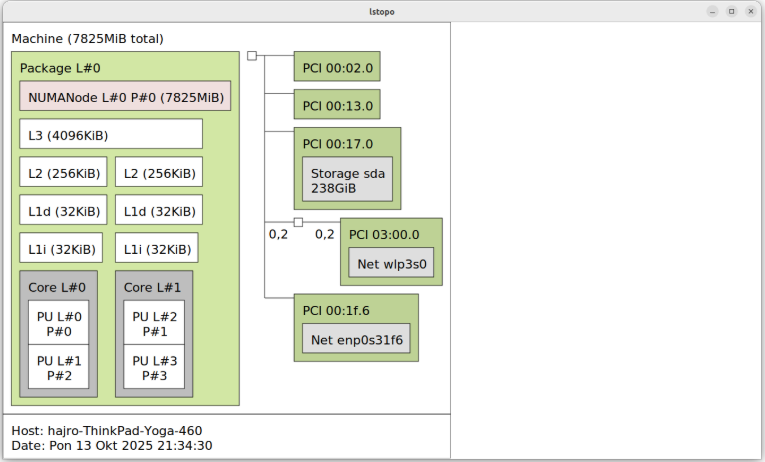
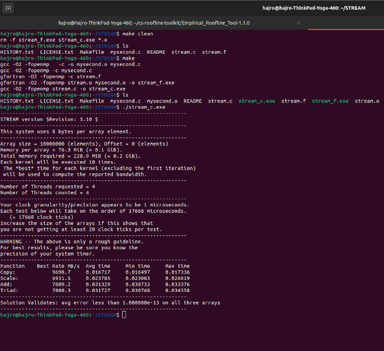
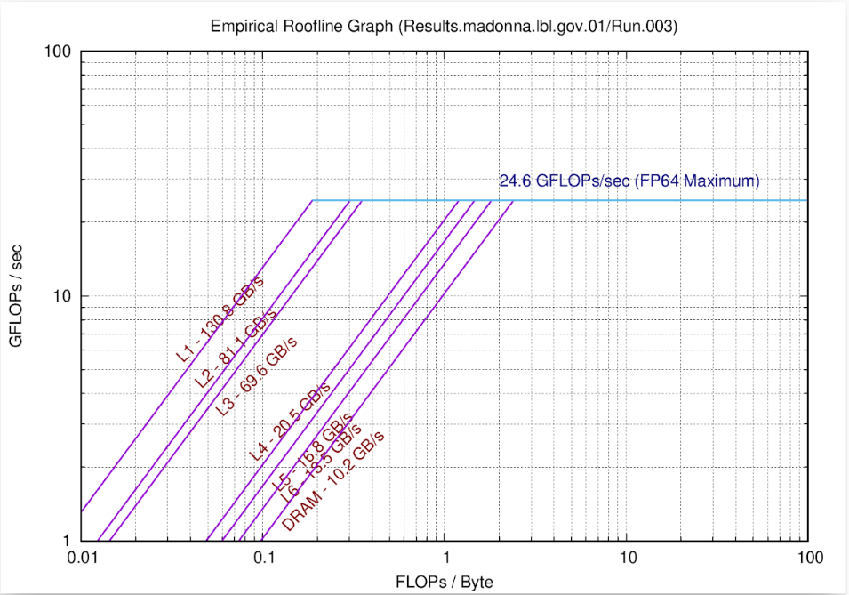
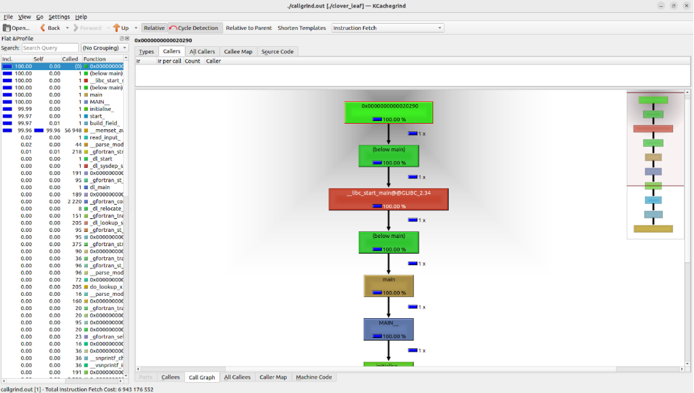
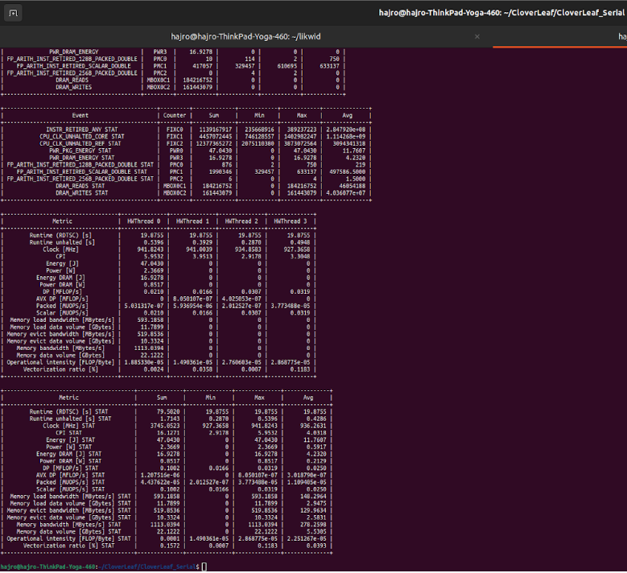

***
# IT 2004 - Parallel Programming: Lab 03
## Performance Limits and Profiling

---

## 1. LAB OBJECTIVE

The main goal of this lab is to understand how application performance is limited by hardware, applying established performance models and profiling tools. We will measure theoretical and empirical limits to identify performance bottlenecks.

**Key Skills:**
*   **Hardware Limits:** Differentiate limitations imposed by computational **Speeds** (FLOPs/s) and data **Feeds** (Memory Bandwidth, GB/s).
*   **Roofline Visualization:** Plot application performance (GFLOPs/s) against hardware limits to determine if the code is **compute-bound** or **bandwidth-limited**.

---

## 2. LAB TASKS

### Example 1 - cairo & hwloc (Hardware Topology Discovery)

**What it does:**
The `hwloc` tool discovers the complete **hardware topology** of the computer. It graphically identifies key components like CPU sockets, individual cores and threads, shared caches (L1, L2, L3), and memory regions (NUMA nodes). The `cairo` library is used as a dependency to draw the graphical output. Running the `lstopo` command provides this visual map of the system's architecture.

### Example 2 - STREAM Benchmarking (Memory Bandwidth Measurement)

**What it does:**
The **STREAM Benchmark** is a micro-benchmark used specifically for the empirical measurement of **memory bandwidth**. It runs simple operations (Copy, Scale, Add, Triad) that stream large amounts of data from main memory. The result is the **maximum possible data transfer rate** (empirical bandwidth) that the CPU can achieve, which is essential for defining the sloped line on the Roofline plot.

### Example 3 - Roofline Toolkit (Performance Visualization)

**What it does:**
The Empirical Roofline Tool (ERT) generates the **Roofline Model** graph. This plot visualizes performance (GFLOPs/s on the Y-axis) against **Arithmetic Intensity** (FLOPs/Byte on the X-axis).
*   The **horizontal line** represents the theoretical maximum flop rate (the compute limit).
*   The **sloped lines** represent the limit imposed by memory bandwidth (the feeds limit).
The tool uses MPI and OpenMP settings to measure the system's limits when accessing different memory levels (e.g., L1, L2, L3, DRAM).

### Example 4 - CloverLeaf (Callgrind Hot-Spot Profiling)

**What it does:**
We use the **Callgrind tool** (part of Valgrind) to generate a **call graph** for the application (CloverLeaf). The visualization (using KCacheGrind) shows the execution hierarchy and identifies the **time-consuming parts (hot spots)** of the code. This process is crucial because it allows programmers to target their limited optimization resources toward the routines where they will have the most performance impact.

### Example 5 - likwid (Hardware Counter Metrics)

**What it does:**
The **likwid** tool suite is a command-line profiling tool that accesses **hardware performance counters**. Its primary use is to obtain detailed, empirical measurements of the application’s execution. Specifically, likwid measures and reports the **Operational Intensity** (or Arithmetic Intensity, FLOPs/byte), which is vital for plotting the application's performance point on the roofline graph. It also reports detailed metrics like memory bandwidth, clock frequency, and energy consumption.

---